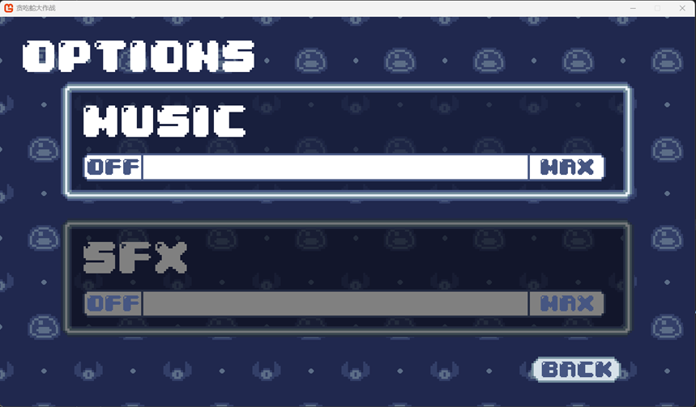
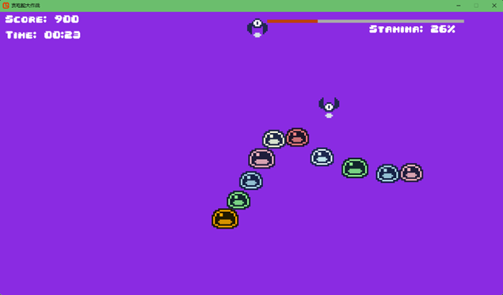
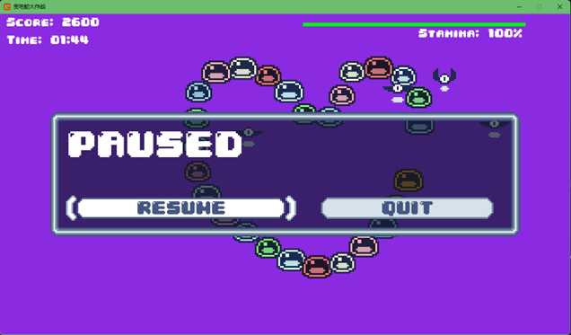
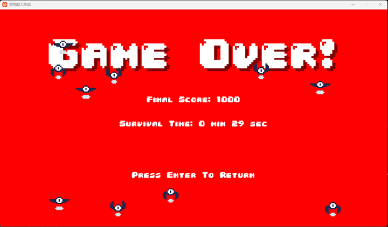

# 🎮 Dungeon Slime（地牢史莱姆）

<div align="center">


一个基于MonoGame开发的贪吃蛇游戏

[](https://dotnet.microsoft.com/)
[](https://monogame.net/)
[](LICENSE)

</div>

## 📖 项目简介

Dungeon Slime是一款经典的贪吃蛇游戏，玩家控制一只可爱的史莱姆在地牢中收集蝙蝠。游戏融入了体力系统、排行榜等现代游戏元素，让经典玩法焕发新生。

## ✨ 游戏特性

- 🐍 **经典贪吃蛇玩法** - 控制史莱姆收集蝙蝠，身体会不断变长
- ⚡ **体力冲刺系统** - 按住空格键可以加速冲刺，但会消耗体力
- 🏆 **排行榜系统** - 记录最高分和存活时间
- 🎵 **音效与音乐** - 完整的背景音乐和音效系统
- 🎮 **多输入支持** - 支持键盘和手柄操作
- ⚙️ **选项设置** - 可调节音乐和音效音量
- ⏸️ **暂停功能** - 随时暂停游戏

## 🎯 操作说明

### 键盘操作
| 按键 | 功能 |
|------|------|
| W / ↑ | 向上移动 |
| S / ↓ | 向下移动 |
| A / ← | 向左移动 |
| D / → | 向右移动 |
| 空格键 | 冲刺（消耗体力） |
| M | 暂停游戏 |
| +/- | 调节音量 |

### 手柄操作
| 按键 | 功能 |
|------|------|
| 左摇杆 / 方向键 | 移动 |
| 右扳机 | 冲刺 |
| Start | 暂停游戏 |

## 🛠️ 技术栈

- **框架**: .NET 9.0 (Windows)
- **游戏引擎**: MonoGame Framework 3.8
- **UI系统**: Gum UI Framework
- **开发工具**: JetBrains Rider / Visual Studio

## 📦 项目结构

```
DungeonSlime/
├── DungeonSLime/              # 主游戏项目
│   ├── Scenes/               # 游戏场景
│   │   ├── TitleScene.cs     # 标题场景
│   │   ├── GameScene.cs      # 游戏场景
│   │   └── GameoverScene.cs  # 游戏结束场景
│   ├── UI/                   # UI组件
│   │   ├── AnimatedButton.cs # 动画按钮
│   │   └── OptionSlider.cs   # 选项滑块
│   ├── Content/              # 游戏资源
│   │   ├── audio/           # 音频文件
│   │   ├── fonts/           # 字体文件
│   │   └── images/          # 图片资源
│   ├── Game1.cs             # 游戏主类
│   ├── Slime.cs             # 史莱姆类
│   ├── Bat.cs               # 蝙蝠类
│   └── LeaderboardManager.cs # 排行榜管理
└── MonoGameLibrary/          # 自定义游戏库
    ├── Audio/               # 音频系统
    ├── Graphic/             # 图形系统
    ├── Input/               # 输入系统
    └── Scenes/              # 场景系统
```

## 🚀 快速开始

### 环境要求

- Windows 10/11
- .NET 9.0 SDK
- Visual Studio 2022 或 JetBrains Rider

### 安装步骤

1. **克隆仓库**
```bash
git clone https://github.com/你的用户名/DungeonSlime.git
cd DungeonSlime
```

2. **还原依赖**
```bash
dotnet restore
```

3. **运行游戏**
```bash
dotnet run --project DungeonSLime
```

### 构建发布版本

```bash
dotnet publish DungeonSLime -c Release -r win-x64 --self-contained
```

## 📸 游戏截图







## 📄 许可证

本项目采用 MIT 许可证 - 查看 [LICENSE](LICENSE) 文件了解详情

## 🙏 致谢

- [MonoGame](https://monogame.net/) - 优秀的跨平台游戏框架
- [Gum](https://github.com/vchelaru/Gum) - 灵活的UI框架

---

<div align="center">

**如果喜欢这个游戏，请给个 ⭐ Star 支持一下！**

</div>